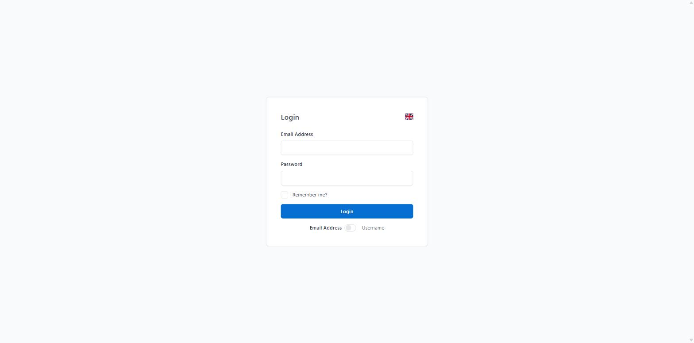
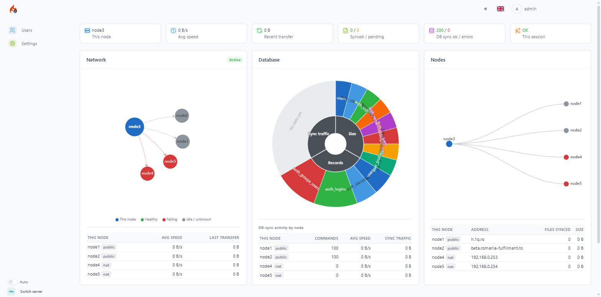
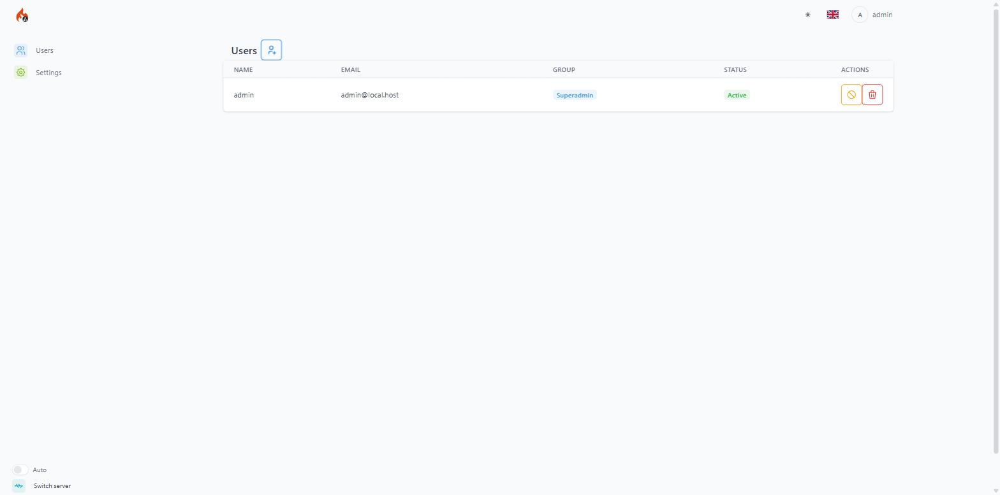
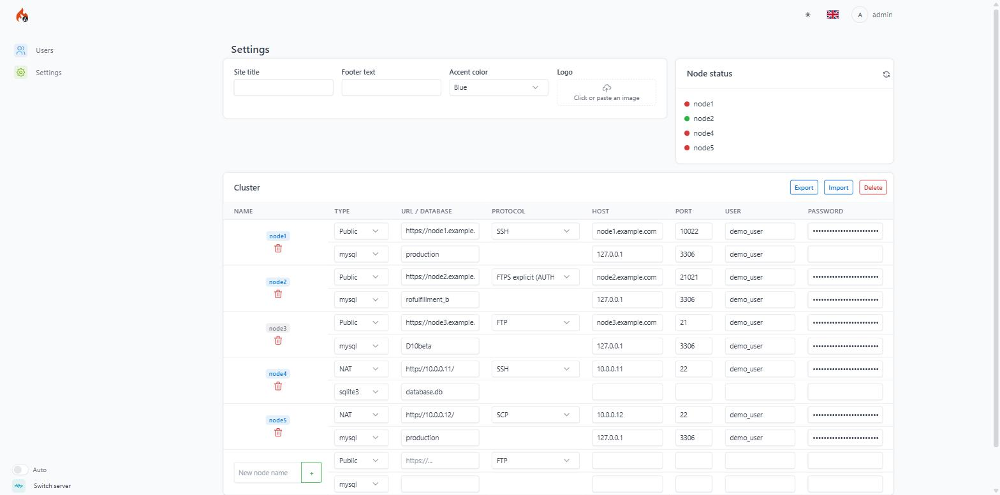

# Asyncron

[](LICENSE)
[](#)
[](#)

A ready-to-run [CodeIgniter 4](https://codeigniter.com/) admin app: multi-master file/database/
session replication across nodes, plus the Dashboard/Profile/Settings/Users UI to run and watch
it. Self-contained - the replication engine and its UI both live directly in this repo, not as
separate packages, so there's nothing to require, trust, or version-pin afterward.

*Unofficial - not affiliated with, or endorsed by, the CodeIgniter Foundation.*

## Screenshots

| Login | Dashboard |
| :---: | :---: |
| [](docs/screenshots/login.jpg) | [](docs/screenshots/dashboard.jpg) |
| **Users** | **Settings** |
| [](docs/screenshots/users.jpg) | [](docs/screenshots/settings.jpg) |

(The Settings screenshot above has its node hostnames/usernames replaced with placeholders - the
real cluster this repo's own demo runs on isn't something to publish recon details about, even
with passwords already masked.)

## Install

```console
composer create-project ad-go/asyncron my-app --repository='{"type":"git","url":"https://github.com/ad-go/Asyncron.git"}'
```

(Not on Packagist, so a bare URL isn't enough for `create-project` to resolve the package name from -
the `--repository` flag points it at this repo directly. No `--stability=dev` needed as of the
`v0.0.1` tag - if you specifically want the bleeding edge instead of the latest tagged release, add
`:dev-main` after `ad-go/asyncron` and put `--stability=dev` back.)

One command. It fetches every dependency, generates `.env` (SQLite by default, an
`encryption.key`), runs every migration, and creates the first login:

- email: `admin@local.host`
- password: `admin1234`

Change that password from the Profile page before this goes anywhere near the public internet -
see `app/Commands/InstallCommand.php` if you ever need to re-run or adjust this step.

A live instance seeded with these exact credentials is running at
**[beta.upz.ro](https://beta.upz.ro)** - log in there directly rather than installing locally just
to look around.

## Running it

- Point your webserver's document root at `public/`.
- Add this to cron, once a minute:
  ```
  * * * * * cd /path/to/my-app && php spark tasks:run >> writable/logs/tasks_cron.log 2>&1
  ```
  That one line covers replication (file/DB sync, NAT pulling, SSH checks) AND the outbound queue
  worker - `app/Config/Tasks.php` schedules `queue:work cluster-files --stop-when-empty` itself, so
  a separate crontab line for it would just be redundant, not additive.
- Clustering itself is opt-in: a single install works standalone with no peers configured.

## Adding a node to the cluster

Two ways to get from "standalone install" to "replicating mesh," both ending at the same `.env`
state (`cluster.nodes`/`thisNode`/`secretToken`/`signingPrivateKey` - see
`src/Config/Cluster.php`'s own docblocks for the exact shape):

- **The Settings page** (Cluster card, superadmin only) - the normal path. Add each peer by name,
  URL, and its file-sync (FTP/FTPS/SSH/SCP) + database credentials; the same row is fully
  editable, name included. Once at least two nodes are listed with real, reachable credentials,
  the page itself finishes the rest automatically the next time it (or `addNode()`) runs: it
  tests each peer's file-sync credentials directly, and once one succeeds, generates this node's
  own RSA-2048 signing keypair and exchanges public keys with that peer over a dedicated
  handshake endpoint (`SettingsController::clusterHandshake()`) - no separate "activate" step, no
  copy-pasting keys by hand. That handshake trusts a caller only if its claimed name and URL
  already match an entry *this* node's own admin typed in - not a blind shared secret, but not a
  cryptographic proof of origin either; fine for a small set of servers you administer yourself,
  not a defense against a targeted attacker who also reaches the endpoint and guesses a
  registered name before real pairing happens. Export/Import round-trips the whole node+database
  credential book as one JSON file; "Delete" wipes this node's own cluster config back to a fresh
  install (other nodes are untouched).
- **By hand** - set `cluster.nodes`/`cluster.thisNode`/`cluster.secretToken`/
  `cluster.signingPrivateKey` directly in `.env` on each node. What the Settings page above does
  automatically, just typed in yourself.

## How it works

Every node runs the exact same install; clustering is just `.env` config pointing nodes at each
other (see "Adding a node to the cluster" above). Two node types:

- **public** - has a real HTTPS base URL, reachable directly. Other nodes push straight to it.
- **nat** - behind a firewall, reachable by nothing. It still participates fully, just by pulling
  instead of being pushed to: `cluster:pull`/`cluster:long-poll` (both scheduled every minute -
  see `app/Config/Tasks.php`) connect OUT to each public peer on their own, catching up on
  whatever was pushed to that peer since its last pass. `cluster:long-poll` additionally holds
  each connection open for up to ~28s and rotates through peers within one cron tick, cutting
  typical NAT latency well under the full minute worst case - see
  `src/Commands/LongPollCommand.php`'s own docblock for the exact mechanics.

Everything below rides that same public-push / NAT-pull split:

- **File sync** - `cluster:sync-files` scans configured `syncPaths` for new/changed content and
  pushes it to every public peer over multipart HTTPS (`src/Jobs/PushFileJob.php`); deletions
  propagate the same way, as their own separate mechanism (`src/DeletedFiles.php`). See
  `src/Cluster.php`.
- **Database sync** - `cluster:sync-db` mirrors `users`/`settings`/any table listed in
  `Config\Cluster::$dbSyncGroup`, keyed by each table's own natural key (email; class+key+context)
  since row IDs are node-local and never portable, last-write-wins by row timestamp. See
  `src/DbSyncSchema.php`'s own top docblock for the full shape.
- **Sessions & SSO** - a password change or logout invalidates that email's sessions everywhere
  (`src/SessionInvalidation.php`), and a short-lived signed ticket lets an already-logged-in user
  land on another node still logged in (`src/Controllers/SsoController.php`) - it doesn't depend
  on DB sync to work, it just declines gracefully back to that node's own login page if the
  account hasn't synced there yet.
- **SSH connectivity checks & clock drift** - `src/SshChecker.php` runs a real login-and-exec
  check (queued right after every login, and again on a schedule); `src/Commands/
  TimeDriftCommand.php` estimates this node's clock offset against every peer via Cristian's
  algorithm, feeding the mtime correction sync itself applies live at transfer time. Both surface
  on the Dashboard.
- **Remote connection testing** - the Settings page's per-node "test" badge runs a real connect
  against that node's file-sync AND database credentials together. For a public target this is
  synchronous; for a NAT target it's relayed through that node's own next pull cycle
  (`src/Controllers/RemoteTestController.php`), so it can take anywhere up to that pull cadence,
  not instant.
- **Peer authentication** - every peer-to-peer call carries a signed `Authorization: Bearer
  <node>.<timestamp>.<signature>` header (RSA-2048/SHA256, `Cluster::authHeader()`/
  `verifyAuthHeader()`), checked against that peer's public key on file - never a value the
  request itself supplies. A node with no signing key yet falls back to a legacy shared
  `cluster.secretToken`, but only as a rollout safety net: once every peer's public key is on
  file, the shared secret stops being sufficient on its own to authenticate as anyone.
- **Node-status LEDs** - the Settings page's Cluster card shows one tricolor LED per peer
  (green/red/gray), live-updating every 5s (`SettingsController::nodeStatus()` +
  `public/assets/settings-node-status.js`). The color is a composite of four independent
  signals (`Cluster::peerHealthStatuses()`) - file sync, SSH reachability, DB sync, and
  stuck/failing queue jobs - so a peer with no file-sync attempt logged yet still shows red
  when one of the other three has actually failed, rather than reading as merely idle.
- **Restart cluster** - the same Node-status card's own icon button
  (`SettingsController::restartCluster()`) tests every known peer's file-sync AND database
  credentials in one click (public peers synchronously, NAT peers queued for their own next
  pull cycle same as any other test), drops one small marker file (node name, timestamp,
  `reset`) into the shared sync directory so there's always real content to push even on an
  otherwise quiet cluster, then kicks `cluster:sync-files`/`cluster:sync-db`/a `queue:work`
  drain/`cluster:realign` off immediately instead of waiting for the next cron-triggered
  `tasks:run` tick. Each of those runs as a bounded child process (a few seconds each, not
  awaited to completion) - the point is a head start, not a synchronous guarantee; the normal
  per-minute cron cadence still finishes whatever a short budget didn't.
- **Conflict resolution UI** - the Dashboard's own "File conflicts" card lists every conflict
  `Cluster::preserveConflictLoser()` has ever archived (winner/loser/when), with a "Restore
  archived version" button per row (`Dashboard::restoreConflict()`) that copies the archived
  losing bytes back over the current file and lets the next `cluster:sync-files` pass push that
  reversal out to every peer, same as any other local edit would.
- **Per-node Settings-sync toggle** - the Node-status card's own "Settings sync with other
  nodes" checkbox (`SettingsController::updateSettingsSync()`) turns the `settings` table's own
  cluster sync off/on for THIS node specifically, both directions - `cluster:sync-db` stops
  exporting local settings changes while off, and any incoming settings command (push or pull)
  is ignored, all gated through one choke point (`DbSyncSchema::settingsSyncEnabled()`). Nothing
  else - files, users, and any `dbSyncGroup`-discovered table keep syncing normally. A live
  Settings-panel checkbox rather than a `.env` flag like `$fileSyncEnabled`/`$sessionSyncEnabled`
  on purpose: unlike those two, this is only ever checked from the once-a-minute cron path and
  incoming-sync handlers, never on every web request, so a DB read here costs nothing worth
  avoiding.

## Not built yet

- The Dashboard's "synced" status reflects this node's own manifest, not a confirmed per-peer
  delivery receipt - it means "this node has this exact content," not "every peer definitely does
  too."
- Test-connection latency for a NAT node is bounded by that node's own cron tick (every minute in
  the common case), so a click can take anywhere from near-instant to just under a minute - see
  "How it works" above.

## What's inside

- [CodeIgniter 4](https://github.com/codeigniter4/CodeIgniter4) - the framework itself
- [Shield](https://github.com/codeigniter4/shield) - authentication, users, groups
- [Settings](https://github.com/codeigniter4/settings) - every autosaving field this UI has
- [Tasks](https://github.com/codeigniter4/tasks) - schedules every `cluster:*` command
- [Queue](https://github.com/codeigniter4/queue) - the async jobs replication sends
- [phpseclib](https://github.com/phpseclib/phpseclib) - the SSH connectivity checks
- [Tabler](https://tabler.io/) - the UI's CSS/JS, bundled under `public/assets/tabler/`
- [flag-icons](https://github.com/lipis/flag-icons) - the language-switcher SVGs, under
  `public/assets/flags/`
- [Apache ECharts](https://echarts.apache.org/) - the Dashboard's network graph, bundled under
  `public/assets/echarts/`

See `src/` (the replication engine, namespace `AdGo\Cluster`) and `app/` (the UI) for how each of
these actually works - every class/method's own docblock is the authoritative reference, not a
separate docs page that can drift out of sync with the code.

## License

MIT - see [LICENSE](LICENSE).
